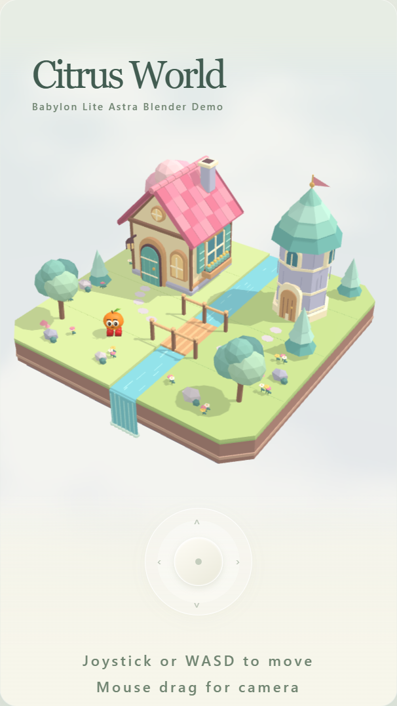

<!-- AI: Customize this template from the target repository's actual files, configuration, and user instructions. Preserve the section order, heading styles, and concise format unless asked to change them. Replace placeholders only with verified information; leave unknown values as placeholders. Do not invent features, commands, URLs, contributors, or deployment behavior. Keep these instructions hidden as HTML comments. -->
<!-- AI: Preserve the creator banner unless a replacement is requested. Update its relative path if assets move and verify the file exists with matching filename capitalization. -->

# Babylon Lite Astra Blender Demo

<!-- AI: Replace {PROJECT_NAME} with the requested project display name. Write one short introduction sentence explaining what the project does and who it is for, based on implemented behavior. -->
A small Babylon.js playground for wandering a Blender-authored floating village with an animated orange character.

## Images

<!-- AI: Use screenshots that exist in this repository and represent the current project. Keep relative paths, matching link href and image src, and the 400-pixel preview width. Replace placeholder alt text with a brief description. Preserve image order unless instructed otherwise; do not invent asset paths. -->

## Demo

<!-- AI: Replace both {demo_url} occurrences with the verified public demo URL. Check deployment configuration or a confirmed deployed site; do not assume a hosting URL. Keep the placeholder if no demo is available. -->
- [Play Citrus World](https://samuelasherrivello.github.io/babylon-lite-astra-blender-demo/)
- [Download v0.1.0](https://github.com/SamuelAsherRivello/babylon-lite-astra-blender-demo/releases/tag/v0.1.0)

## Table of Contents

<!-- AI: Keep this list synchronized with the top-level sections below it and their Markdown anchors. Exclude the title, Images, Demo, and Table of Contents because they appear above or here. Do not add subsection entries unless requested. -->
1. [Getting Started](#getting-started)
2. [Project Overview](#project-overview)
3. [Project Details](#project-details)
4. [Resources](#resources)
5. [Credits](#credits)

## Getting Started

<!-- AI: Briefly state required tools or prerequisites, using versions supported by the repository. Keep setup steps in the subsections below and use the fewest practical steps. Do not add a separate commands section. -->
Use Node.js 24.12 or newer and npm. Asset authoring uses Blender; the tested local installation is Steam Blender 5.2.1 LTS.

### 🛠 Build Project

<!-- AI: Replace {command} with the actual build command or required editor action. Verify it against manifests, scripts, or project settings. Specify the working directory and dependency installation when necessary; do not assume npm or a particular engine. -->
1. From the repository root, run `npm ci`.
2. Run `npm run check` to test, check types and build `dist/`.

### 🛠 Run Project

<!-- AI: Replace {command} with the actual local launch command or editor action. State where to run it and how to open the app if needed. Refer to the printed URL when the port can vary. Avoid repeating completed build/setup steps. -->
1. Run `npm run dev` from the repository root and open the printed localhost URL.

### 🛠 Release Version

<!-- AI: Describe the repository's existing release workflow in the fewest steps, based on checked-in workflows or release scripts. Distinguish builds, tags, releases, and deployment accurately. If no release process exists, retain a placeholder rather than inventing one. Documentation edits do not authorize publishing or changing Git history. -->
1. Run `npm run check` and `npm run spec:validate`.
2. Commit and push normally to `https://github.com/SamuelAsherRivello/babylon-lite-astra-blender-demo.git`; CI checks the project and stores the static build. The original checkout retains the inherited template `origin`: never push to that template remote. Use the explicit new-repository URL and intended branch.
3. Dispatch **Deploy live demo**, verify the live game, then create a new versioned GitHub release for the verified commit.

## Project Overview

<!-- AI: Summarize the project's purpose, main capabilities, and intended use cases. Describe current implementation; label planned capabilities explicitly rather than presenting them as complete. Keep detailed tooling under Project Details. -->
Citrus World presents a pastel cottage, mint-roof tower, stream and bridge inside a 9:16 frame that fits both viewport dimensions. The orange character walks with WASD or the thumb joystick, faces its direction of travel, and switches between Idle and Walk. Radius-aware navigation keeps it on the island and clear of buildings, trees and water.

Drag the world with the left mouse button or a finger to orbit its fixed center. Scroll to zoom. The camera stays independent of the character. Joystick release, cancellation, focus loss and resizing clear active input.

### 📝 Documentation

<!-- AI: Link to the main documentation files that actually exist using relative Markdown links and a short purpose for each. Update links when files move; do not reference documentation inherited from another project unless present here. -->
- [Asset contract](docs/asset-contract.md): Coordinates, authoring paths, animations and navigation.
- [Setup provenance](docs/template-provenance.md): Template history and active planning root.
- [Coordination request](docs/coordination/request.md): Approved scope and task boundaries.
- [Blender toolchain](docs/blender-toolchain.md): Project-local Blender and MCP setup and verification.
- [Gameplay verification](docs/coordination/C004-gameplay.md): Controls, browser acceptance and screenshot evidence.

### 📝 Structure

<!-- AI: Replace PROJECT_NAME with the actual main project directory and list only the few folders needed to understand the repository. Check paths and capitalization. Omit generated output, dependency folders, and exhaustive file inventories. -->
- `src/`: Browser application.
- `scripts/`: Local authoring tools.
- `public/assets/`: Exported runtime assets supplied by asset tasks.
- `assets/blender/`: Blender source scripts and projects supplied by asset tasks.
- `openspec/`: Active project proposals and specifications.

## Project Details

<!-- AI: Replace this placeholder with a short description of implementation details useful to developers. Verify the stack from repository files and avoid repeating the overview or claiming unverified package versions. -->
TypeScript and Vite bundle Babylon.js core and glTF loaders, preferring WebGPU with WebGL fallback. Native HTML/CSS supplies the shell without a UI library. `npm test` covers renderer fallback, camera-relative input, fixed-center camera limits and radius-aware navigation. The reproducible browser script is documented in the gameplay handoff. `npm run blender -- --version` discovers Blender without changing global settings.

### 📦 AI

<!-- AI: List AI tools and specification workflows configured or documented for this repository. Use official links and concise descriptions; verify current official wording before using a tagline. Treat inherited entries as examples to validate, not proof of installed tooling. -->
- [Codex](https://openai.com/codex/): Project development and task coordination.
- [OpenSpec](https://openspec.dev/): Specification-driven development

### 📦 Packages

<!-- AI: List the key packages actually used, based on manifests and configuration. Link each name to its official site or documentation and describe its role briefly. Replace template examples that do not apply. Include versions only when useful and verified against the repository. -->
- [Vite](https://vite.dev/): JavaScript bundling and local dev server.
- [Babylon.js](https://www.babylonjs.com/): WebGPU/WebGL rendering and glTF loading.
- [TypeScript](https://www.typescriptlang.org/): Static type checking.
- [Vitest](https://vitest.dev/): Automated tests.

## Resources

<!-- AI: Keep relevant external learning and best-practice links with readable labels and short descriptions. Preserve the existing Best Practices resource unless asked to replace it. Verify new destinations and avoid duplicating local documentation links. -->
- [Best Practices](https://www.SamuelAsherRivello.com/best-practices/) - Procedures prescribed as the most effective

## Credits

<!-- AI: Preserve established attribution and ownership. Customize the following subsections only from confirmed contributor, contact, and license information; do not infer a new owner from the repository name. -->
### 💡 Contributors

<!-- AI: Preserve existing contributor credit and add contributors only when confirmed. Do not automatically advance experience counts or their reference year. -->
- Samuel Asher Rivello - Over 25 years of game development experience as of 2026

### 💡 Contact

<!-- AI: Preserve confirmed contact destinations and their order unless requested otherwise. Use readable display URLs without a protocol or trailing slash while keeping the real link target intact. Do not invent accounts or change target capitalization based on display styling. -->
- [LinkedIn.com/in/SamuelAsherRivello](https://Linkedin.com/in/SamuelAsherRivello) ⭐ 
- [GitHub.com/SamuelAsherRivello](https://github.com/SamuelAsherRivello/)
- [Twitter.com/srivello](https://twitter.com/srivello/)
- Resume / Portfolio: [SamuelAsherRivello.com](http://www.SamuelAsherRivello.com)

### 💡 License

<!-- AI: Keep the license name linked to the actual relative license file and verify that its terms match this statement. Keep the copyright holder and year consistent with that file. Do not change license terms, ownership, or dates without an explicit request. -->
- Provided as-is under the [MIT License](LICENSE).

- Copyright © 2026 Rivello Multimedia Consulting, LLC.
